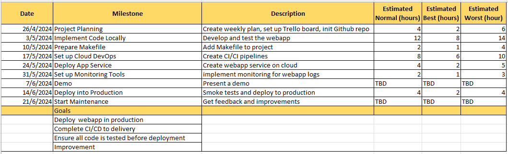
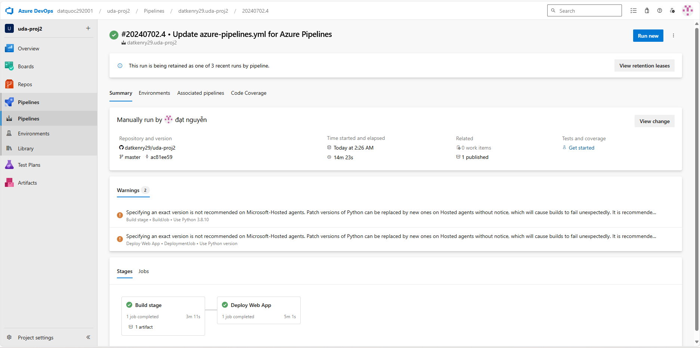

[](https://github.com/datkenry29/uda-proj2/actions/workflows/main.yaml)

[](https://dev.azure.com/datquoc292001/uda-proj2/_build/latest?definitionId=3&branchName=master)

# Overview

This project involves building a Continuous Integration and Continuous Delivery (CI/CD) pipeline using Azure DevOps. The main goal is to automate the deployment of a Python application to Azure App Services, ensuring the application is tested and delivered efficiently and reliably. The project demonstrates core DevOps principles such as Infrastructure as Code (IaC), Continuous Integration, and Continuous Delivery, leveraging tools like Azure Cloud Shell, GitHub Actions, and Azure Pipelines.

## Project Plan

- **Trello Board**:
  
- **Project Plan Spreadsheet**:
  
  The spreadsheet includes:
  - Quarterly and yearly plan
  - Weekly deliverables
  - Estimates of difficulty and time for each task

The Trello board contains:

- Cards for key tasks
- A simple board-based flow: To Do, In Progress, Done

## Instructions

### Architectural Diagram


The architectural diagram shows how key parts of the system interact, including the CI/CD pipeline, Azure services, and the deployed application.

### Running the Python Project

1. **Clone the Project into Azure Cloud Shell**
   - Open Azure Cloud Shell.
   - Create a ssh key
     ```
     ssh-keygen -t rsa
     ```
     
   - Copy the public key to your Github Account:
     
   - Clone the repository:
     ```
     git clone https://github.com/datkenry29/uda-proj2.git
     ```
     
   - Navigate to the project directory:
     ```
     cd uda-proj2/webapp/flask-sklearn
     ```
     
2. **Run Tests in Azure Cloud Shell**
   - Create Python Virtual Enviroment to run your application
     ```
     python3 -m venv ./.venv
     ```
     
   - Install dependencies and run the tests using the Makefile:
     ```
     make all
     ```
     
     
   - Run application
     ```
     export FLASK_APP=app.py
     flask run
     ```
     
   - Above step would launch a Python Virtual Environment and would run the application. Launch a new Azure Cloud shell session and test the application by running the make_prediction.sh script
     ```
     ./make_prediction.sh
     ```
     
   - `CTRL-C` to stop the Flask application
   - To deactivate the virtual environment run `deactivate`

### Azure App Service

1. **Create new Resource Group**
   - Run command below:
     ```
     az group create --name uda-proj2-rg --location eastus
     ```
     
2. **Deploy the Application using Azure CLI**

   - Deploy the application to Azure App Service:

     ```
     az webapp up --sku F1 --name flask-ml-uda-proj2 --resource-group uda-proj2-rg
     ```

     

     The Azure CLI commands in a Bash script called commands.sh file in the GitHub repo contains the steps Set up Azure CLI and Deploy Application

   - Our application will be deployed and available at https://${app-name}azurewebsites.net default port is 443
     
   - Azure app service from the Azure portal
     

### Github Action

1. **Successful deploy of the project in GitHub Actions**
   
   

### Azure DevOps

1. **Set Up Azure Pipelines for Continuous Delivery**
   - Navigate to [dev.azure.com](dev.azure.com) and sign in. Then create new project if not exitst.
     
   - Once the project is created, from the new project page, select Project settings from the left navigation. On the Project Settings page, select Pipelines > Service connections, then select New service connection.
     
   - In the New Service Connections dialog, select Azure Resource Manager from the dropdown.
     
   - In `New Azure service connection` dialogue box, select `Workload Identity federation (automatic)`.
     
   - Press `Next` and do following steps:
     - Select scope level as `Subscription`
     - You might need to log in
     - Pick the Resource Group of the Azure Web App deployed
     - Input a valid Service Connection Name
     - Need to check the box Grant Access Permissions to all pipelines
     - Save
       
2. **Azure Pipeline App**

   - From your project page left navigation, navigate to `Pipelines` -> `Create Pipelines`
     
   - In the New Pipeline screen -> Select GitHub as Repo -> Select the Project
     
     
   - In tab `Configure`, select `Python to Linux Azure Webapp` -> Select the deployed app -> Validate and configure
   - 

   - Create an Azure Pipeline in Azure DevOps.
   - Configure the pipeline to build and deploy the application automatically.
     
     
     
     

3. **Run a Load Test with Locust**

   - Install Locust and run the load test:
     ```
     locust -f locustfile.py
     ```
     
     

4. **Test the Deployed Application**

   - Run a prediction from the deployed application:

   ```
   ./make_predict_azure_app.sh
   ```

   

5. **Stream Log Files**
   - Stream the log files from the deployed application:
     ```
     az webapp log tail --name flask-ml-uda-proj2 --resource-group uda-proj2-rg
     ```
     

## Enhancements

In the future, the project can be improved by:

- Integrating automated security scans into the CI/CD pipeline.
- Implementing advanced monitoring and alerting with Azure Monitor.
- Enhancing the application with additional features and functionalities.
- Optimizing the CI/CD pipeline for performance and scalability.

## Demo

Watch the project demo on YouTube: [Project Demo Screencast](https://youtu.be/0B0m2Ut7wMk)

[](https://www.youtube.com/watch?v=0B0m2Ut7wMk)

The screencast demonstrates:

- The working Azure Cloud Shell environment for Continuous Integration.
- The GitHub Actions build process.
- Successful deployment using Continuous Delivery on the Azure platform.
- A machine learning prediction returning a JSON payload.
